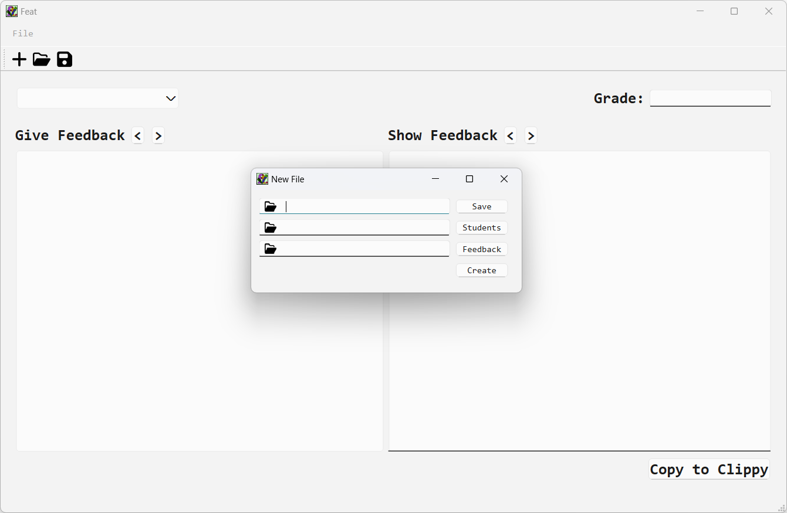

# Feat
Feedback Experiment Aansturing Tool

Create fast feedback messages based on your own prewritten feedback file and add personalised feedback per student. Feat requires you to import a list of student, which allows you to create feedback messages with personal salutation. It also gives you the opportunity to easily switch between the feedback text for all students in your group. You can save the .feat file and continue to provide feedback. With a single click the feedback messages is copied to your clipboard and ready to send to your students using the communication method of your choice. 

## Features
* Import prewritten feedback
* Import student names
* Switch between feedback messages of students
* Have personal salutations
* Add personalised feedback for each feedback section
* Add personalised feedback in a general section
* Add general complimentary close
* Save the feedback messages
* Copy the feedback messages to the clipboard

## Screenshots
Select **file > new**, a new window appears. 



* Select the location to save the .feat file and give it a name.
* Select the file with student names.
* select the file with feedback.

Click create to create the .feat file and start composing feedback. 

Select **file > open** to open a .feat file. 


## File Format Specifications
### Student file
The file(.txt) with student names should be designed in the following way:
```
# Teaching assistant (information)
first_name lastname (unique_student_id)
first_name lastname (unique_student_id)
```
Text after '#' can be arbitrary since lines with '#' will be skipped. First names with spaces must be connected with "_".
There is an [example student file](teststudenten.txt) available. 

### Feedback form
The file(.toml) with feedback should be designed in the following way:
```
["Section 1"]
Unique_id = "Feedbackline 1"
Unique_id = "Feedbackline 2"
Unique_id = "Feedbackline 3" 
Unique_id = "Feedbackline 4"

["Section 2"]
Unique_id = "Feedbackline 1"
Unique_id = "Feedbackline 2"
Unique_id = "Feedbackline 3"
Unique_id = "Feedbackline 4"

```
The unique IDs must be unique within the feedback form.
There is an [example feedback form](feedbackpunten.toml) available. 

## Install
In a virtual environment:
```
pip install feat-feedback-tool
```

Or with pipx:
```
pipx install feat-feedback-tool
```

Open Feat with ft. 
```
ft.
```

### Development instructions
Clone the repository

Create a new conda environment with python
```
conda create -n feat python
``` 
Activate the new conda enviornment
```
conda activate feat
```
Install Feat with poetry install
```
poetry install
```
Open Feat with ft. 
```
ft.
```